# 如何为Kronorium CN贡献

## 基础工具安装与配置

本文工具安装均在64位 windows 10 1903下完成，至于你是linux用户想必也不需要看这些废话。

### VS Code 的安装与配置

vs code在本项目里作为免费的代码或markdown编辑器使用，你可以换用任何你喜欢的工具。

前往[VS Code官网](https://code.visualstudio.com/)

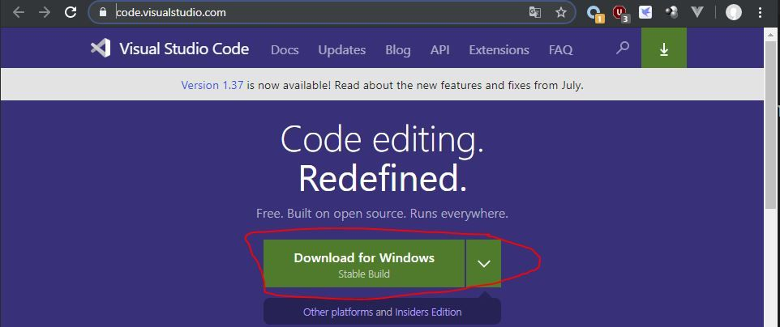

建议全部勾选，这样用起来更加方便

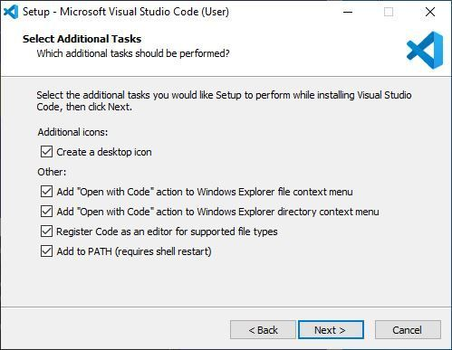

可能你会觉得编辑器的字号很小，你可以按`ctrl+,`快捷键，点击侧边栏的Text Editor-Font，在右边看到Font Size，改成你喜欢的字号大小。

### node.js 的安装与配置

node.js为本项目的运行时。

前往[node.js官网](https://nodejs.org/en/)

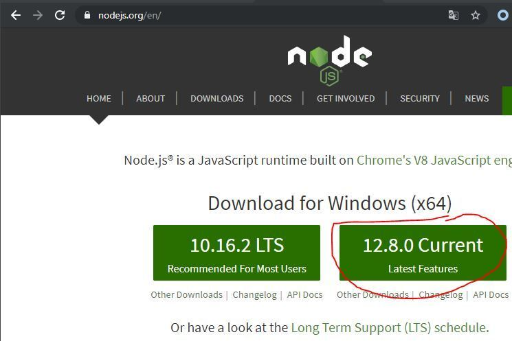

打开Powershell，输入如下命令验证安装

```  
node --version
```

若出现例如v12.8.0等版本号则安装成功

### yarn 的安装与配置

yarn作为本项目的node的包管理工具使用。

前往[yarn官网](https://yarnpkg.com/zh-Hans/docs/install#windows-stable)（你可能需要科学上网才能正常下载），按提示下载安装，并验证安装。

### windows-build-tools的安装与配置

（这个步骤可能需要科学上网）

windows-build-tools会安装python 2.7和vs 2017构建工具，node-nyp需要这些环境的支持

以管理员模式打开powershell，输入

```  
npm install --global --production windows-build-tools
```

这个过程非常缓慢，请耐心等待。如果卡住请多试几次。

看到All done则安装成功。

### git 的安装与配置

::: warning
 如果你是第一次听说git，那你可以忽略下面所有和git有关的步骤，将markdown和素材在qq群内交给管理员代为合并。
 
 你可以去[主仓库地址](https://github.com/kronorium-cn/Kronorium-CN)下载压缩包部署

:::

git为本项目的版本控制工具

前往[git官网](https://git-scm.com/download/)（你可能需要科学上网才能正常下载）
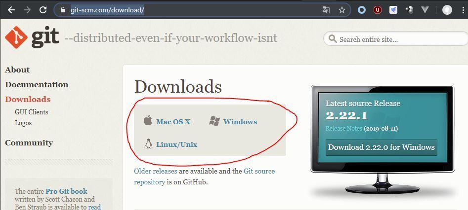

勾选以增加体验

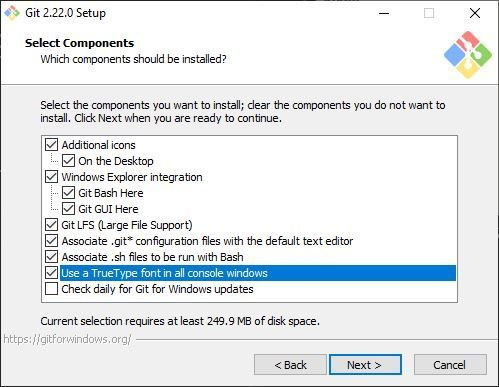

改为使用vs code作为默认编辑器，其余默认

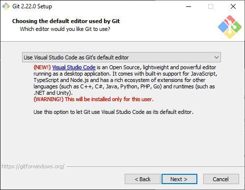

接下来配置git，在开始菜单中打开git bash，输入git config --global user.email + "你的邮箱"，例如当邮箱为gf7600gs@outlook.com时。

```
git config --global user.email "gf7600gs@outlook.com"
```

接下来输入git config --global user.name + 你的名字，例如名字是AnotherFackAccount时

```
git config --global user.name "AnotherFackAccount"
```

## 注册GitHub账号

[github官网](https://github.com/join)

依次输入用户名，邮箱，密码，验证你不是bot。

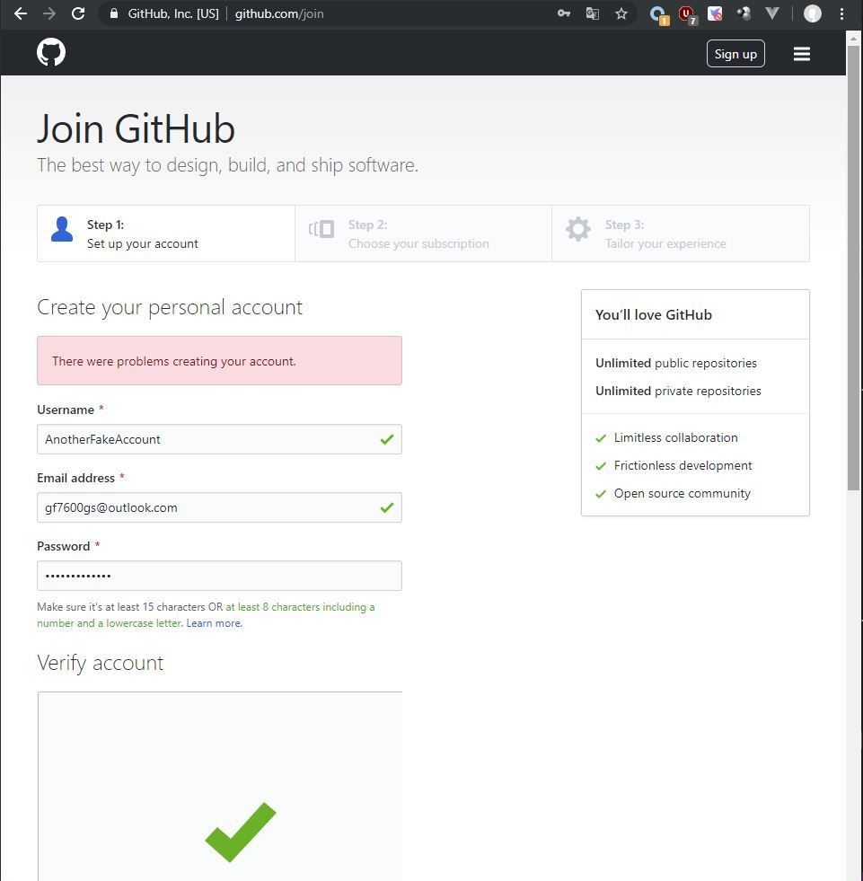

点击 Create an account 按钮完成账户创建。

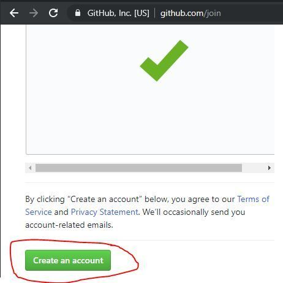

直接点continue

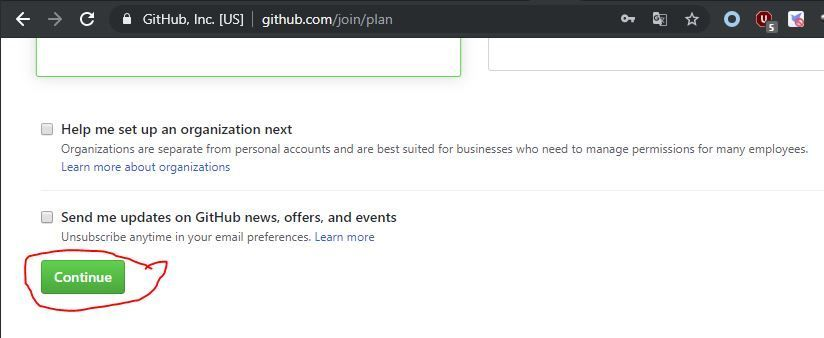

直接点skip this step

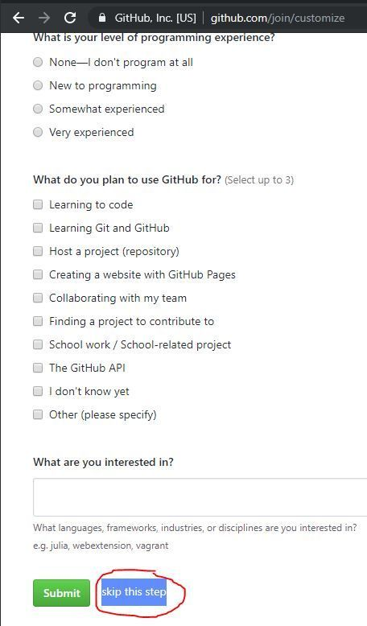

接下来你的邮箱会收到一份邮件，点击verify email address。注册完成。

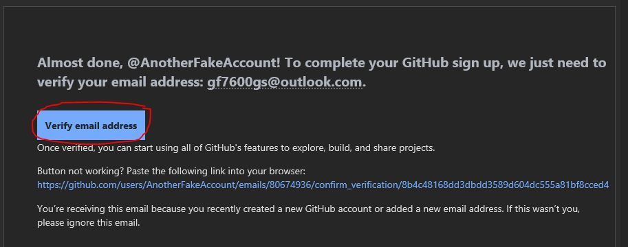

## 查看项目，寻找可以提供的贡献

进入[主仓库地址](https://github.com/kronorium-cn/Kronorium-CN)

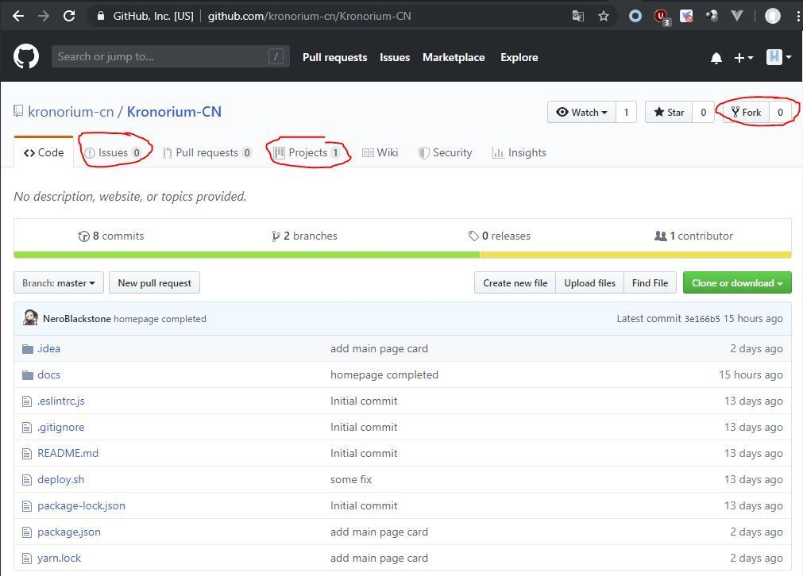

首先查看Project,这里有所有待完成的网站内容。你可以挑一些你熟悉且感兴趣的工作。比如你想开坑IX的内容编写。

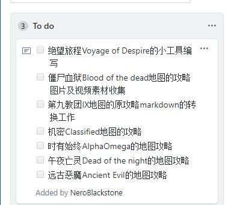

接下来你可以查看issues。但是你发现有人已经先你一步，他已经抢先开始了IX的工作。

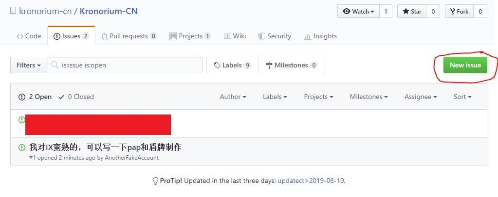

于是你决定还是改一下网站的README，点击New issue。再点击submit new issue提交。

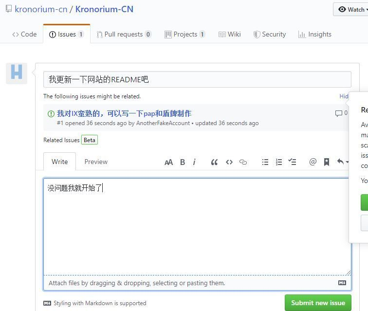

## 拉取项目

首先在主仓库右上角点击Fork。稍等一会儿，你的GitHub会复制这个项目。你可以在你的仓库首页看到Kronorium-CN。(github.com/你的github用户名/Kronorium-CN)

这个时候你可以在你的仓库复制仓库地址，并且你可以观察到你的分支与主仓库没有任何差异（This branch is even with kronorium-cn:master.）

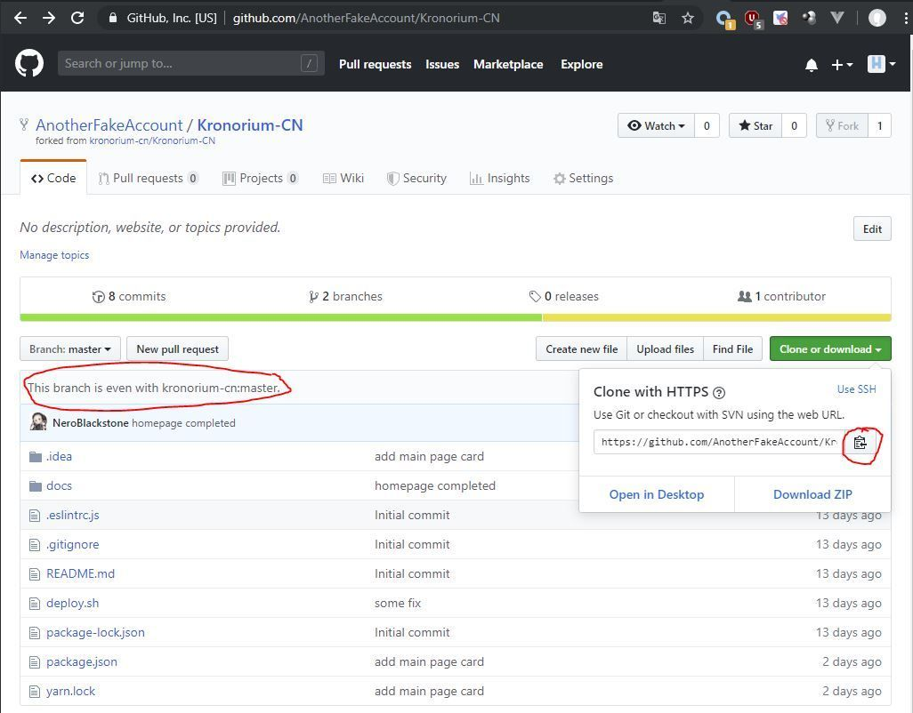

首先在你电脑上找个文件夹，右键，选择git bash here。这会打开git bash窗口。

在git bash窗口输入git clone + 你的仓库地址，将仓库拉到本地。例如当仓库地址为https://github.com/AnotherFakeAccount/Kronorium-CN.git时：

```
git clone  https://github.com/AnotherFakeAccount/Kronorium-CN.git
```

然后请配置远程仓库

```
git remote add upstream https://github.com/kronorium-cn/Kronorium-CN.git
```

查看一下远程仓库，应该是这样的
```
git remote -v
```

```
origin  https://github.com/AnotherFakeAccount/Kronorium-CN.git (fetch)
origin  https://github.com/AnotherFakeAccount/Kronorium-CN.git (push)
upstream        https://github.com/kronorium-cn/Kronorium-CN.git (fetch)
upstream        https://github.com/kronorium-cn/Kronorium-CN.git (push)
```

你会下载到一个名为Kronorium-CN的文件，打开可以看到源码，对文件夹右键，再次选择git bash here。这次你要创建一个分支，并切换到该分支上。命令为git checkout -b + 分支名，假设我们分支名为change-readme，命令为：

```
git checkout -b change-readme
```

这个例子里若git bash提示Switched to branch 'change-readme'则成功了。

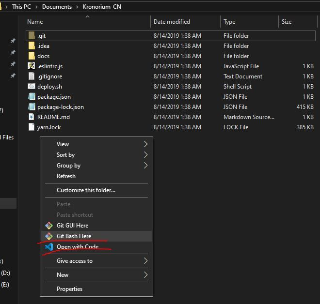

然后再对这个文件夹右键，选择open with code，vs code会打开这个文件夹。

## 目录结构

本项目用到的静态网页生成工具为[vuepress](https://v1.vuepress.vuejs.org/zh/)，你可以在上面了解更多关于目录结构的信息。

```
Kronorium-CN-master--docs (代表所有文档)
                     |-README.md(首页内容配置)
                     |-zh(中文内容)
                     | |-guide（所有的地图攻略放在这里）
                     | |  |-bo4(黑色行动4的攻略)
                     | |    |-voyage_of_despair（绝望之旅的内容）
                     | |      |-video（绝望之旅文档内的视频内容）
                     | |      |-image（绝望之旅文档内的图片内容）
                     | |      |-audio（绝望之旅文档内的音频内容）
                     | |      |-voyage_of_despair.md（绝望之旅的文档内容）
                     | |    ...
                     | |    |-其余地图
                     | |-contribute （贡献指南文章）
                     | |-chronicles （僵尸编年史文章）
                     | |-faq (faq文章)
                     |-.vuepress（存放了一些vue组件和网页源码）
                        |components(存放了页面内用的vue组件和组件用到的静态资源)
                        |theme（vue主题源码）
                        |dist（生成的网页）
                        |public（一些网页公用的静态资源）
                        |styles（网页的一些样式配置）
                        |enhanceApp.js(buefy组件库导入代码)
                        |config.js(主页和侧边栏配置，以及一些插件配置)
```

除了docs/readme.md文件,zh文件夹,和.vuepress文件夹的config.js，其余的文件禁止文档维护人员修改

## 运行项目

在vs code的explorer侧边栏中，右键，选择open in terminal。

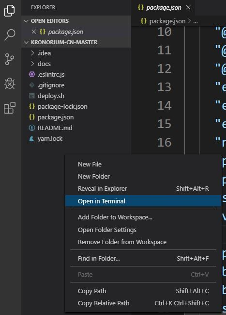

打开的窗口中，输入下列命令安装依赖。如果package.json没有更改，这个命令只需执行一次。（这个过程比较缓慢，请耐心等待）（可能需要科学上网）


```
yarn install
```

之后执行

```
yarn docs:dev
```

你可以看到项目已经跑起来了，在下方蓝色链接上，`按住ctrl+鼠标左键`，即可在本地打开Kronorium CN

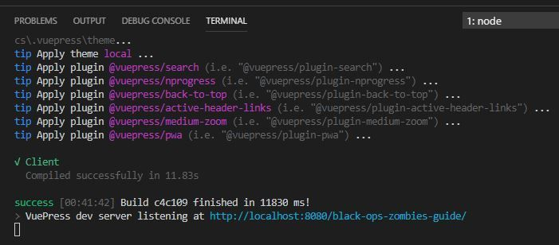

## 编写文档

这次我们修改docs/zh/guide/readme.md页面

打开文件，点击右上角的小图标打开markdown预览，写一点内容。

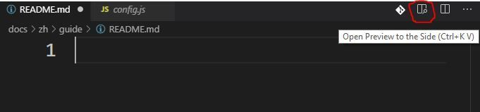

在编写过程中可以看到右边vs code内建的预览。如果你的markdown格式正确，那么预览也是正确的

按`ctrl+s`保存文件，你会发现Kronorium CN网页的内容立刻改变了，这是Vuepress的热重载功能。你可以随时保存markdown文件以查看在网页中的最终效果。

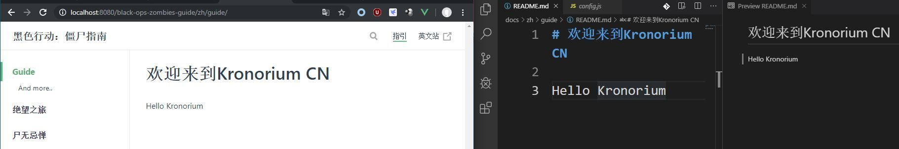

## markdown格式

码字需要markdown格式，你可以在这里学习：[例子](https://markdown-it.github.io/)

另外vuepress提供了一些[markdown扩展](https://v1.vuepress.vuejs.org/zh/guide/markdown.html#markdown-%E6%8B%93%E5%B1%95)

另外本项目也提供了一些vue组件供在markdown内使用：

```
//插入显示图片的链接
<imageLink title="链接文字"></imageLink>
```
例如：<imageLink title="插入显示图片的链接"></imageLink>

```
//插入视频链接
<videoLink title="链接文字"><source src="./video/视频名"/></videoLink>
```

```
//插入音乐
<audio controls><source src="./audio/音乐文件名"></audio>
```

另外qq群内有更详细的文档介绍。

## 静态文件格式要求

由于pwa会自动缓存静态文件到客户端本地，也为了更加苗条的网页打包大小，因此对静态文件格式做一些要求：

图片若非logo，一律使用jpg格式，禁止png。

视频请压缩到480p，30fps，700kbps码率左右。mp4格式。

音乐压缩到96kbps。mp3格式。

看起来压缩有点严格，实际上我认为在传输速率和可视/读性找到了一个比较好的平衡。原始上万码率的视频对移动网络几乎是不可接受的。请理解。

## 提交文档

你完成了所有的文档编写的工作。在网页内确认无误。在vs code下方的终端(Terminal)中按`ctrl+c`结束vuepress进程。

接着输入命令将所有修改提到暂存区

```
git add -A
```

然后提交，git commit -m + "提交信息"，例如你这次修改了readme，你可以这样写：

```
git commit -m "change readme"
```

接下来推送到github，使用git push origin + 之前你使用的分支名称，比如你上次新建的分支为change-readme:

```
git push origin change-readme
```

然后输入你的github账号和密码。

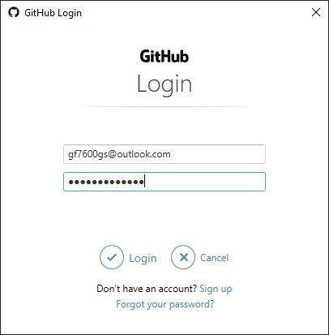

然后你就可以看到

```
To https://github.com/AnotherFakeAccount/Kronorium-CN.git
 * [new branch]      change-readme -> change-readme
```

那么分支推送已经成功了，去github看看。

你可以看到已经推送上来了，再点击compare & pull request，可以提交合并申请。

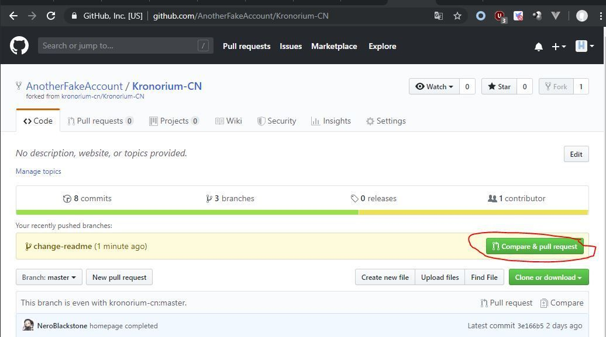

再点击Create pull request，完事。

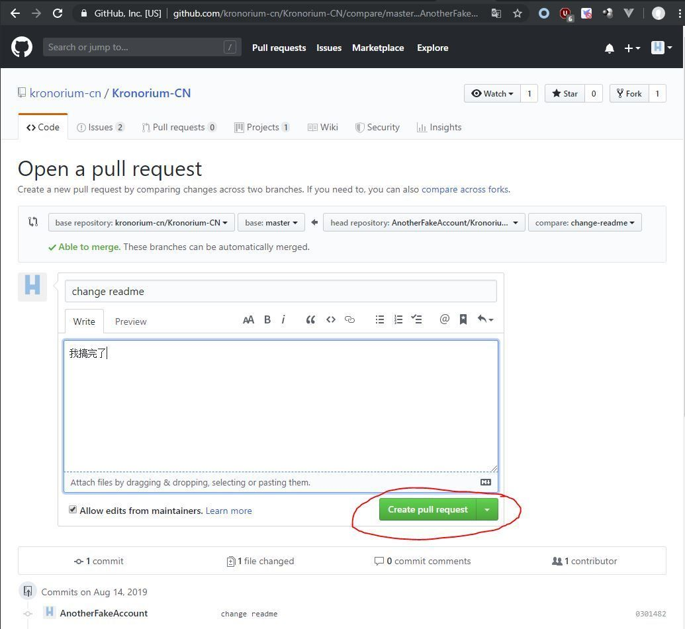

## 再一次贡献

你想再次贡献，但是往往主仓库代码已经变动了，这就需要同步主仓库的代码。请依次执行：

```
git fetch upstream
git checkout master
git merge upstream/master
```

再更新依赖：

```
yarn install
```

现在你的代码与主分支已经同步。若有冲突，推荐备份你的修改，重新clone原项目。

之后请建立新分支，下面的步骤都和第一次贡献一样。